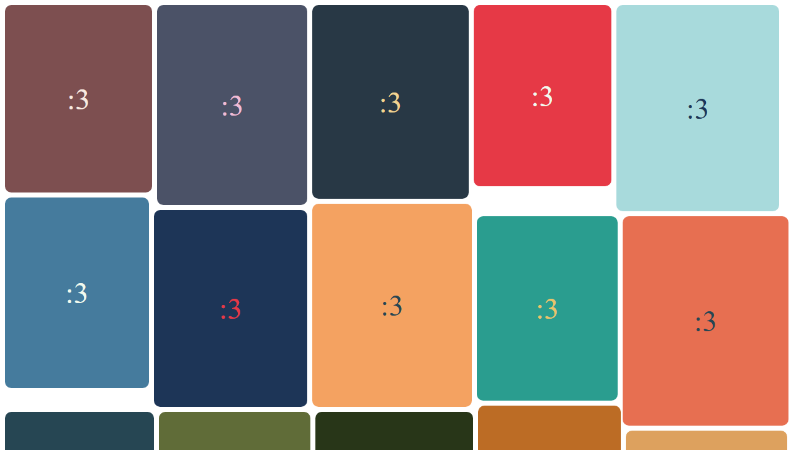

# Meowsonry

[](./LICENSE) [](https://www.npmjs.com/package/meowsonry-layout)

A lightweight, extensible masonry layout library for modern web applications. Built with TypeScript and inspired by middleware architecture patterns.



## Features

- ✅ **Intelligent row-based positioning** - Optimizes vertical space across columns
- ✅ **Middleware architecture** - Extend and customize layout behavior
- ✅ **Responsive design** - Automatically adapts to container width changes
- ✅ **Type-safe** - Fully typed with strict TypeScript
- ✅ **Zero dependencies** - Pure JavaScript/TypeScript implementation
- ✅ **Auto-update support** - Built-in ResizeObserver integration

## Installation

```bash
npm install meowsonry-layout
```

## Basic Usage

```typescript
import { meowsonry } from "meowsonry-layout";

const container = document.querySelector(".masonry") as HTMLElement;

meowsonry({ container });
```

```html
<div class="masonry">
  <div>Item 1</div>
  <div>Item 2</div>
  <div>Item 3</div>
</div>
```

## Configuration

```typescript
meowsonry({
  container: HTMLElement,
  middleware?: Middleware[]
});
```

### Options

| Option       | Type           | Description                  |
| ------------ | -------------- | ---------------------------- |
| `container`  | `HTMLElement`  | Container element (required) |
| `middleware` | `Middleware[]` | Array of custom middleware   |

## Advanced Usage

### With Gap Spacing

```typescript
import { meowsonry, gap } from "meowsonry-layout";

const container = document.querySelector(".masonry") as HTMLElement;

meowsonry({
  container,
  middleware: [gap(16)], // 16px gap between items
});
```

### With Auto-Update

```typescript
import { meowsonry, autoUpdate } from "meowsonry-layout";

const container = document.querySelector(".masonry") as HTMLElement;

// Initialize layout
meowsonry({ container });

// Automatically update on resize
const cleanup = autoUpdate(container, () => {
  meowsonry({ container });
});

// Cleanup when no longer needed
cleanup();
```

## Middleware System

Meowsonry uses a middleware pipeline architecture with three execution phases:

| Type              | When                 | Context         |
| ----------------- | -------------------- | --------------- |
| `beforePlacement` | Once before children | Container-level |
| `placement`       | For each child       | Child-specific  |
| `common`          | In both phases       | Shared          |

### Creating Custom Middleware

```typescript
import { MIDDLEWARE_TYPE } from "meowsonry-layout";

const myMiddleware = {
  type: MIDDLEWARE_TYPE.placement,
  callback: ({ context, setContext }) => {
    // Access and modify context
    console.log("Processing child:", context.currentChildElement);

    // Update context with new values
    setContext((prev) => ({
      ...prev,
      customValue: "example",
    }));
  },
};

meowsonry({
  container,
  middleware: [myMiddleware],
});
```

See [MIDDLEWARE.md](docs/MIDDLEWARE.md) for detailed documentation.

## API Reference

### `meowsonry(options)`

Main layout function that arranges child elements in a masonry grid.

```typescript
function meowsonry({
  container: HTMLElement,
  middleware?: Middleware[]
}): void
```

### `autoUpdate(container, updateFn)`

Sets up automatic updates using ResizeObserver.

```typescript
function autoUpdate(container: HTMLElement, updateFn: () => void): () => void; // cleanup function
```

### `gap(value)`

Creates middleware to add spacing between items.

```typescript
function gap(value: number): BeforePlacementMiddleware;
```

## Testing

Run unit tests:

```bash
npm test
```

Run e2e screenshot tests:

```bash
npm run test.playwright
```

Run e2e tests in UI mode:

```bash
npm run test.playwright.ui
```

Update screenshot snapshots:

```bash
npm run test.playwright.update
```

Type checking:

```bash
npm run typecheck
```

Linting:

```bash
npm run lint
npm run lint.fix
```

## Architecture

Meowsonry uses a **middleware pipeline architecture**:

1. **beforePlacement phase** - Container initialization (executed once)
2. **placement phase** - Child element processing (executed per child)

This approach makes the library highly extensible while keeping the core logic clean and maintainable.

See [ARCHITECTURE.md](ARCHITECTURE.md) for detailed architecture documentation.

## Contributing

See [CODESTYLE.md](CODESTYLE.md) for detailed coding standards.

See [AGENTS.md](AGENTS.md) for agents guidelines including:

- Code style and conventions
- Testing standards
- Commit message format
- Development workflow

## License

MIT - See [LICENSE](LICENSE) for details.

Meow :3
